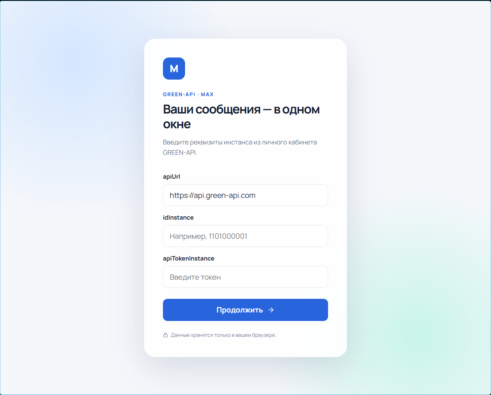
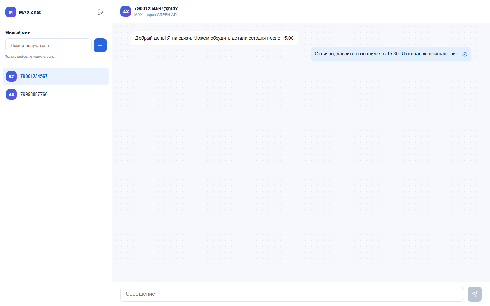

# MAX chat · GREEN-API

Небольшой React-интерфейс для отправки и получения текстовых сообщений в MAX через GREEN-API. Проект выполнен как тестовое задание: только необходимый сценарий, без серверной части и лишней продуктовой логики.

## Стек

- React 19 и TypeScript
- Vite
- Redux Toolkit и RTK Query
- React Router
- SCSS

## Скриншоты

### Вход



### Переписка



## Запуск

Требуется Node.js 18+.

```bash
npm install
npm run dev
```

Для production-сборки используйте:

```bash
npm run build
```

## Ограничения

Это клиентское тестовое приложение, поэтому токен неизбежно находится в браузере пользователя. Для production-системы вызовы GREEN-API и хранение секретов следует вынести на сервер.
